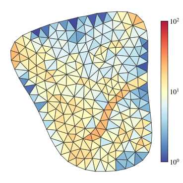
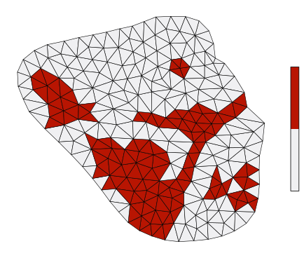
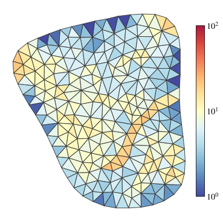
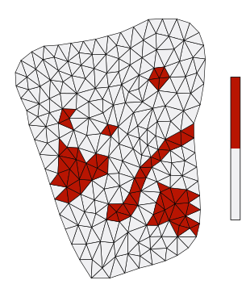
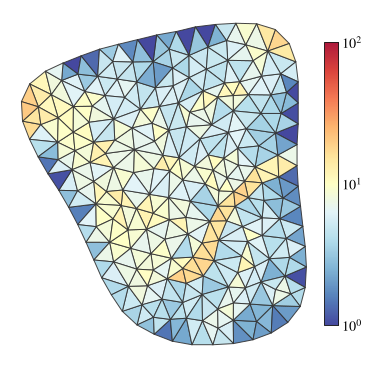
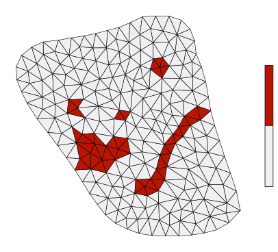
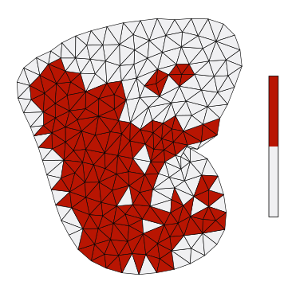

使用应变加权的loss指标（最大）

代码: `task/active_explore_strain.py`, `task/high_stiffnes_filter.py`, `task/stiffoptim_force_ekf.py`

数据集: `20260221_215905_active-strain[1]`

结果: `data/output/evaluation_results_2.pkl` 以及相关的数据

1. contact = [38, 77]

action_value = [0.05893797, 0.01124317]

2. contact = [2, 62]

action_value = [-0.01883467 -0.05696748]

3. contact = [43, 87]

action_value = [ 0.05197912 -0.02997391]

4. contact = [37, 95]

action_value = [0.0557962, 0.0220632]

效果变差

直接使用entropy指标来优化

1. contact = [39, 77]

action_value = [-0.05672818,  0.01954261]

