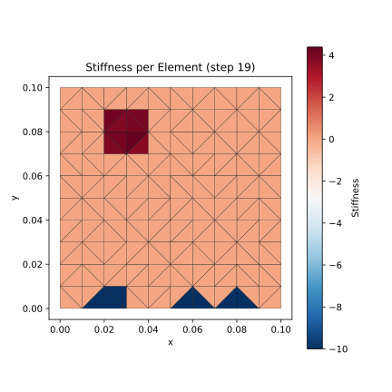
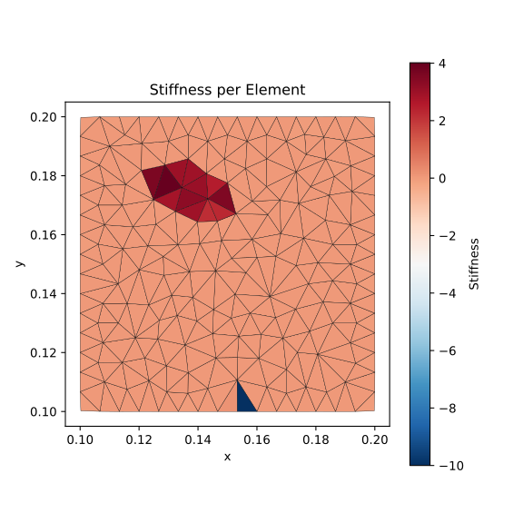

### 非均匀刚度场辨识

**2025-12-23**

基于测量得到的变形场，使用力平衡方程估计每个单元的刚度值，其中“-10”表示超出合理数值边界，为刚度不确定性高的单元。

只用一次迭代和一次数据，即可识别出高刚度区域（深红色区域），不确定性高的单元主要原因是固定边界的外力无法测量。

理论过程：

- 使用测量得到的变形场（节点位置），使用Projective Dynamics中的变形能函数，推导所有节点的内力

- 基于内力-外力平衡方程（准静态过程），使用Newton-Raphson迭代方法求解（只用一次迭代）

- 使用Resolution Matrix评估各个单元格参数辨识的不确定性（图中深蓝色区域为不确定性高的区域）

**2026-1-6**

- 使用opencv的mask，构建了不规则的mesh网格，并使用一组完整的轨迹。

- 边界上的奇异单元不可被辨识，这是mesh划分存在的问题

