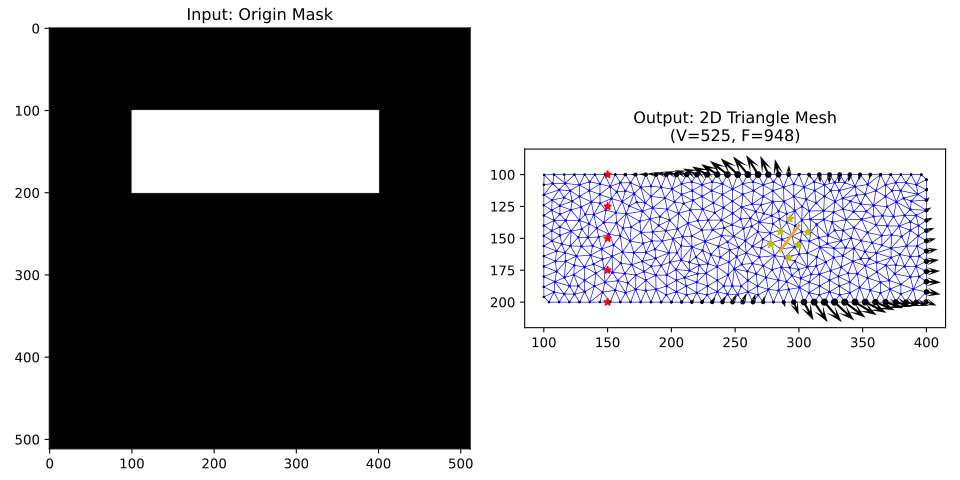
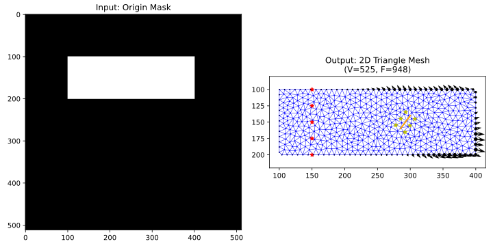

### Image Mask to Affordance Mapping

**2025-11-8**

使用二维图像Mask，通过triangular库划分网格。再构建KD-tree，高效地搜索给定点所在的三角形网格，最近邻的M个点。

使用DiffPD构建的变形模型，估计每个接触点的affordance值。

红色五角星表示Fixed Constraint；橘色线条表示缝合线；黄色五角星表示测量拉伸探针的起始和终止点；箭头表示当前状态下，接触点的最优动作方向以及对应的affordance大小。

**2025-11-9**

改进了上述的affordance求解方法。增加了controllability度量，衡量对特征点的可控能力，用特征点距离control convexhull（contact和fixed nodes围成的多边形）的最短距离来表示。

缺点：当前的方法依赖于超参数，用于对距离进行缩放。

