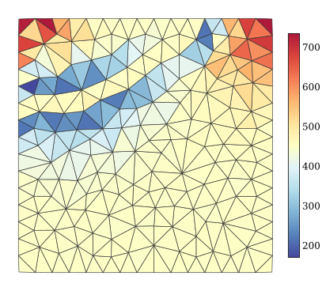
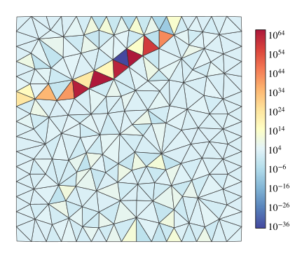
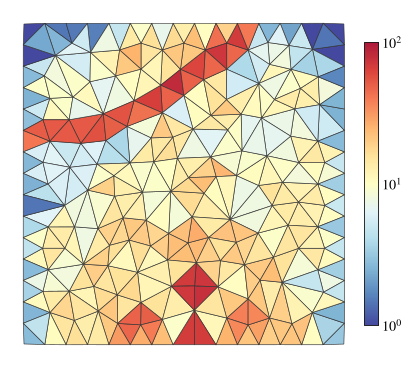
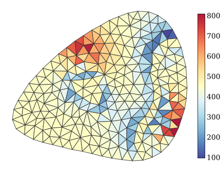
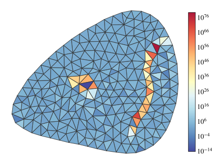
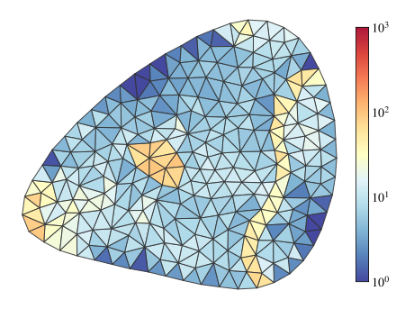

### Filter Hight & Low Stiffness Area

**2026-1-23**

采集一组变形数据，基于内力-外力平衡方程构建观测残差，使用信息滤波视角下的Extended Kalman Filter，估计网格单元的刚度参数

辨识之后的刚度分布和方差分布（均使用log10进行缩放）：

相关代码：stiffoptim_force_ekf.py； stiffoptim_force_gn.py（作为对比）

观察：在刚度分布中，不能分离出高刚度和低刚度区；相反，在方差分布中，可以分离出高刚度区，亦可分离出低刚度区

对高刚度，直接使用GMM分为三类，取高方差区作为高刚度区域：

对低刚度，使用双阈值方法，分离：

相关代码：high_stiffnes_filter.py； low_stffness_filter.

---

### Paper Figure

使用数据的路径: "data/demo/pd_stretch_data_hete/20260213_hard_1"

代码: "task/stiffoptim_force_gn.py"; "task/stiffoptim_force_ekf.py"

**形状一**

Gauss-Newton:

EKF:

**形状二**

接触点: [23, 44]

动作量: [-1, 1] * 0.004, [1.1, -0.9] * 0.004

Gauss-Newton:

EKF:

Metric:

使用AUC和Recall指标

代码: `task/high_stiffnes_filter.py`, `task/high_stiffnes_filter_2threshold.py`, `task/high_stiffness_seperate_metric.py`

