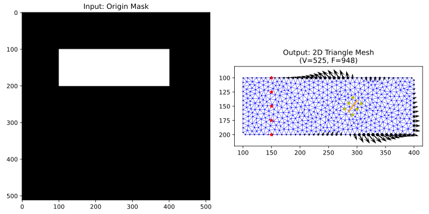

### Image Mask to Affordance Mapping
使用二维图像Mask，通过triangular库划分网格。再构建KD-tree，高效地搜索给定点所在的三角形网格，最近邻的M个点。

使用DiffPD构建的变形模型，估计每个接触点的affordance值。

红色五角星表示Fixed Constraint；橘色线条表示缝合线；黄色五角星表示测量拉伸探针的起始和终止点；箭头表示当前状态下，接触点的最优动作方向以及对应的affordance大小。